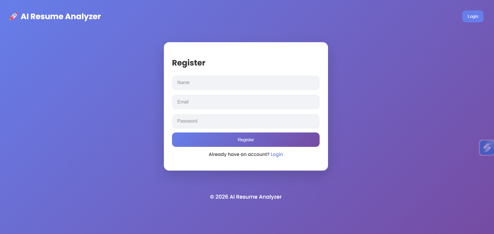
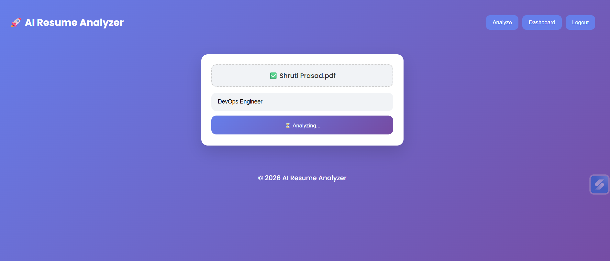
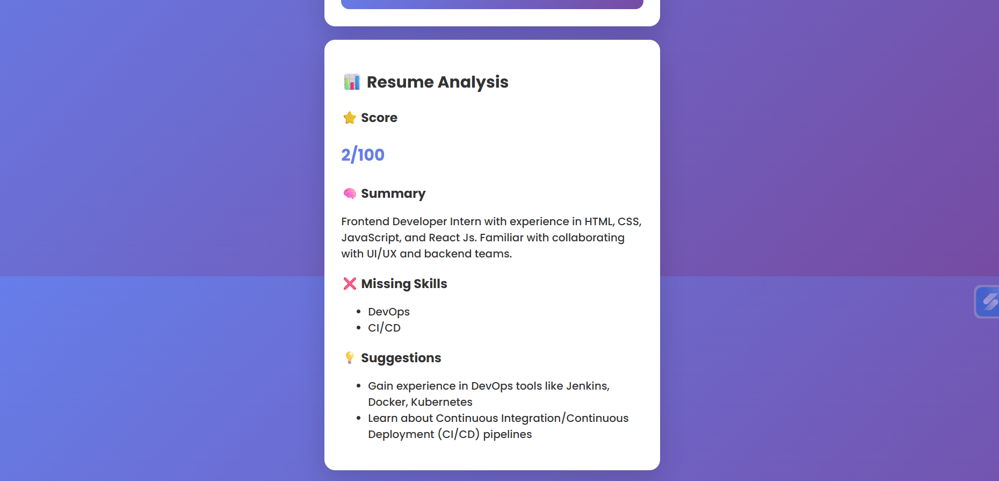

# 🚀 AI Resume Analyzer

An AI-powered full-stack web application that analyzes resumes and provides actionable insights tailored to specific job roles.

🌍 **Live Demo:** https://ai-resume-analyzer-qyi6.onrender.com/

---

## ✨ Features

- 📄 Upload PDF resumes
- 🤖 AI-powered resume analysis (GPT-based)
- 📊 Resume scoring system (out of 100)
- ❌ Missing skills detection
- 💡 Smart improvement suggestions
- 📄 AI-generated improved summary
- 📥 Download analysis report (PDF)
- 🎯 ATS-style resume feedback indicator
- 🔐 User authentication (Login / Register)
- 🎨 Modern SaaS-style UI with animations
- ⚡ Fast and responsive performance

---

## 📸 Screenshots

### 🔐 Login / Register Page


### 📄 Upload Resume Page


### 📊 Analysis Result Page


---

## 🛠 Tech Stack

### Frontend
- React.js
- CSS (Custom styling + animations)

### Backend
- Node.js
- Express.js

### AI Integration
- OpenRouter API (GPT-3.5 Turbo)

### File Handling
- Multer (file upload)
- PDF-Parse (text extraction)

### Deployment
- Render (Full-stack deployment)

---

## ⚙️ How It Works

1. User uploads a resume (PDF)
2. Backend extracts text using `pdf-parse`
3. AI analyzes resume based on selected job role
4. Returns structured JSON:
   - Score
   - Missing Skills
   - Suggestions
   - Improved Summary
5. Frontend displays results in a clean, user-friendly UI

---

## 🔐 Environment Variables

Create a `.env` file in the `/server` folder:
OPENAI_API_KEY=your_api_key_here

---

## 🚀 Run Locally

```bash
# Clone repository
git clone https://github.com/shrutiprasaddd/ai-resume-analyzer.git

# Backend setup
cd server
npm install
node server.js

# Frontend setup
cd ../client
npm install
npm start
```

---

## 💼 Resume Description

Developed a full-stack AI-powered web application to analyze resumes and provide job-specific insights.  
Integrated GPT-based API to generate resume scores, identify skill gaps, and suggest improvements.  
Built a responsive frontend using React and implemented backend services using Node.js and Express.  
Deployed the application on Render with complete frontend-backend integration.

---

## 🚀 Future Enhancements

- 📂 Resume history dashboard  
- 📊 Detailed ATS breakdown (skills match, keywords, experience)  
- 🔐 Secure JWT authentication with database integration  
- 🎯 Job-role based resume matching  
- 📁 Export reports in multiple formats  

---

## 👩‍💻 Author

**Shruti Prasad**

---

## ⭐ Show Your Support

If you like this project, give it a ⭐ on GitHub!
